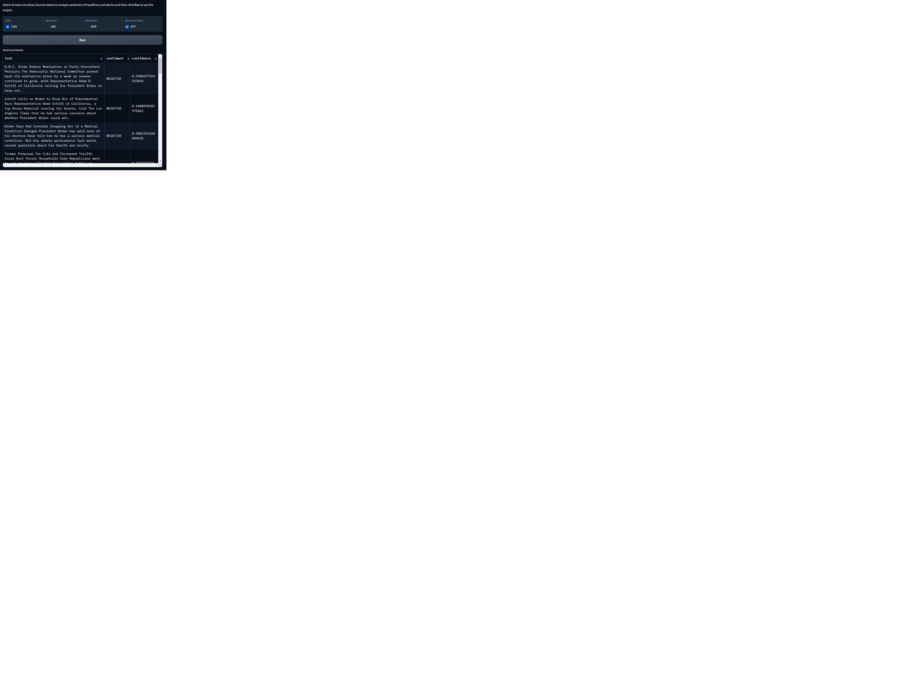

<p><a target="_blank" href="https://app.eraser.io/workspace/Ni40E1o4VIaUCvKZWyhj" id="edit-in-eraser-github-link"></a></p>

# To Run

In your python environment, type:

```
python src/news_sentiment_analyzer/news_sentiment_analyzer.py
```

When you run the script, it will start a local server and provide a URL to access the UI in your web browser. Users can then select news sources and click "Submit" to see the analysis results.

> Notes:

> - Scraping RSS News Feeds to avoid any scraping policy issues

<!-- eraser-additional-content -->

## Diagrams

<!-- eraser-additional-files -->

<a href="/README-News Sentiment Analysis Logical Architecture-1.eraserdiagram" data-element-id="TOiOsN-33paaDsb7CNCpD"></a>

<!-- end-eraser-additional-files -->
<!-- end-eraser-additional-content -->
<!--- Eraser file: https://app.eraser.io/workspace/Ni40E1o4VIaUCvKZWyhj --->

# Sample Output


