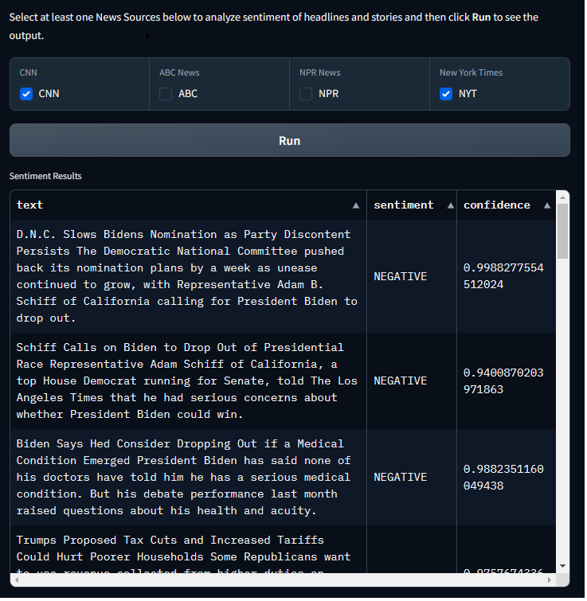

# News Sentiment Analysis Project

## Overview

This project is a News Sentiment Analysis tool that scrapes news articles from various sources and performs sentiment analysis on the content. It provides a user-friendly interface for selecting news sources and viewing the sentiment analysis results.

## Features

- Scrapes news articles from multiple sources (CNN, ABC News, New York Times)
- Performs sentiment analysis on news headlines and descriptions
- Provides a Gradio-based web interface for easy interaction
- Displays results in a clean, tabular format

## Components

- `news_sentiment_analyzer.py` : Main script that orchestrates the news scraping and sentiment analysis process.
- `rss_news_scraper.py`: Contains classes for scraping RSS feeds from different news sources utilizing the Adapter Design Principal.
- `sentiment_analyzer.py`: Implements sentiment analysis using a pre-trained DistilBERT model.

## Requirements

- Python 3.7+
- Required libraries: gradio, pandas, beautifulsoup4, requests, transformers, tqdm, emoji

## Usage

1. Run the main script:

```
python main.py
```

2. When you run the script, it will start a local server and provide a URL to access the UI in your web browser. Users can then select news sources and click "Submit" to see the analysis results.


3. Select one or more news sources (CNN, ABC News, NYT) and click "Run" to start the analysis.
4. View the sentiment analysis results in the table below.

_Sample Output_



## Architecture

The project follows a modular architecture:

- RSSNewsScraper: Scrapes news articles from RSS feeds using specific adapters for each news source.
- SentimentAnalyzer: Performs sentiment analysis on the scraped news content using a pre-trained model.
- NewsSentimentAnalyzer: Coordinates the scraping and analysis processes, and provides the user interface.

<!-- eraser-additional-content -->

## Highlevel Architecture Diagram

<p><a target="_blank" href="https://app.eraser.io/workspace/Ni40E1o4VIaUCvKZWyhj" id="edit-in-eraser-github-link"></a></p>
<!-- eraser-additional-files -->
<a href="/README-News Sentiment Analysis Logical Architecture-1.eraserdiagram" data-element-id="TOiOsN-33paaDsb7CNCpD"></a>
<!-- end-eraser-additional-files -->
<!-- end-eraser-additional-content -->
<!--- Eraser file: https://app.eraser.io/workspace/Ni40E1o4VIaUCvKZWyhj --->

## Testing

The project also comes with a basic set of core pytest files

Run the group of tests via:

```
pytest
```

or individually. For example:

```
pytest -vs tests/test_sentiment_analyzer.py
```

This also shows how you can call the modules directly instead of using the Gradio UI.

## Contact

If you have any questions or feedback, please open an issue on the GitHub repository or reach out via [LinkedIn](https://www.linkedin.com/in/dmickelson/)
